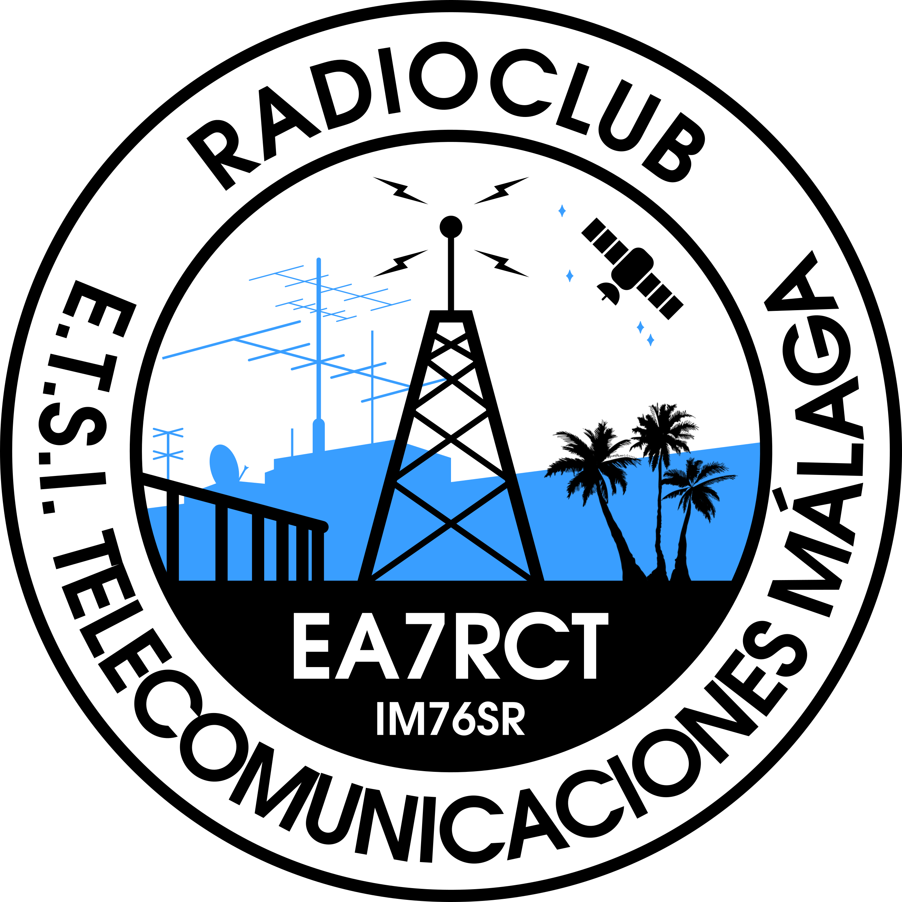

# Requisitos para propuesta

- [ ] Debemos tener los derechos de uso para todos los elementos no "dibujados a mano". No podemos permitirnos un problema como el que sucedión con la Paloma de Picasso en el logo de la UMA.
- [ ] Satélite en el cielo.
- [ ] Callsign fácil de leer.
- [ ] Un formato fácil de imprimir en blanco/negro, o dos versiones, una para imprenta y otra para digital (por ejemplo, en la digital mostrar un fondo de color, pero omitirlo en la imprenta).

# Dudas

- [ ] Insertar fecha de inauguración del club?
- [ ] Radioclub Universidad de Málaga o Radioclub de la ETSI Telecomunicaciones de Málaga?
- [ ] Añadimos 5 flechas en algún sitio? Las flechas tradicionalmente (en la UMA) indican el nivel de ingeniería y van asociado a campos magnéticos.

# Acerca de este repositorio
En la raiz del repositorio se encuentra el fichero [EA7RCT.png](EA7RCT.png). Esta figura muestra siempre la versión más reciente del logo conforme el diseño/trabajo avanza.
